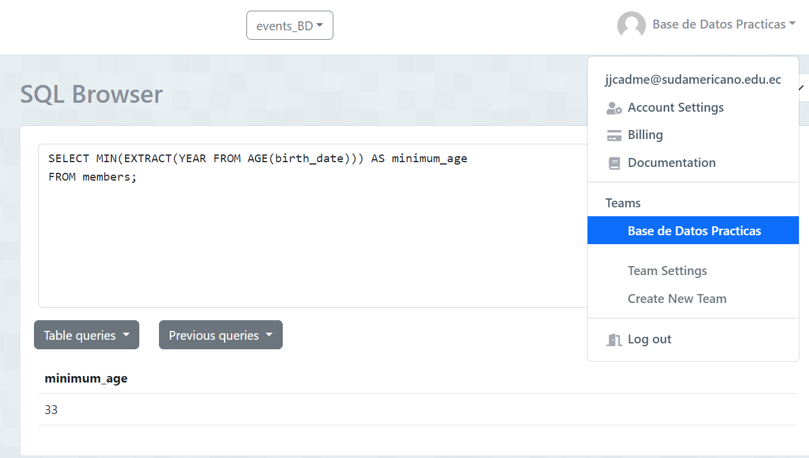
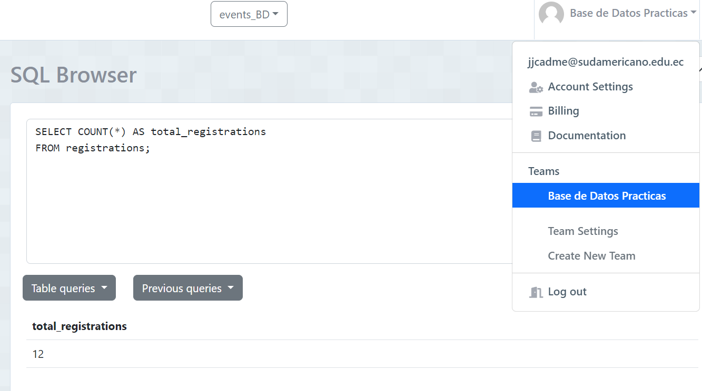
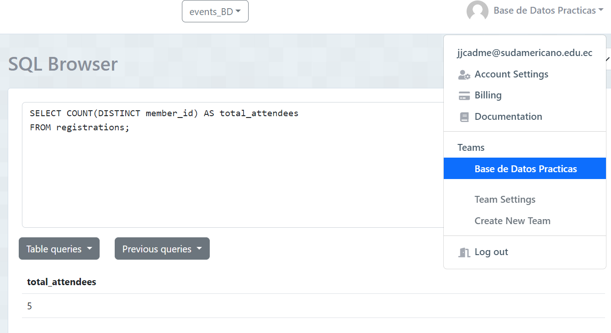
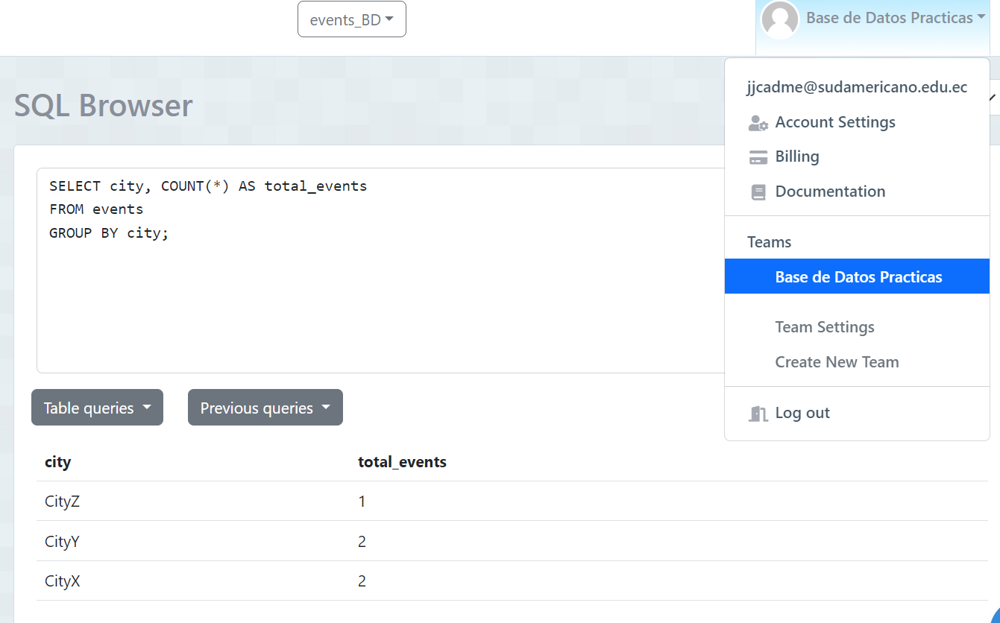
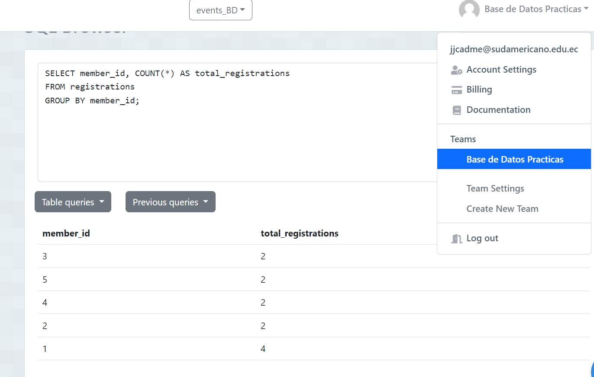
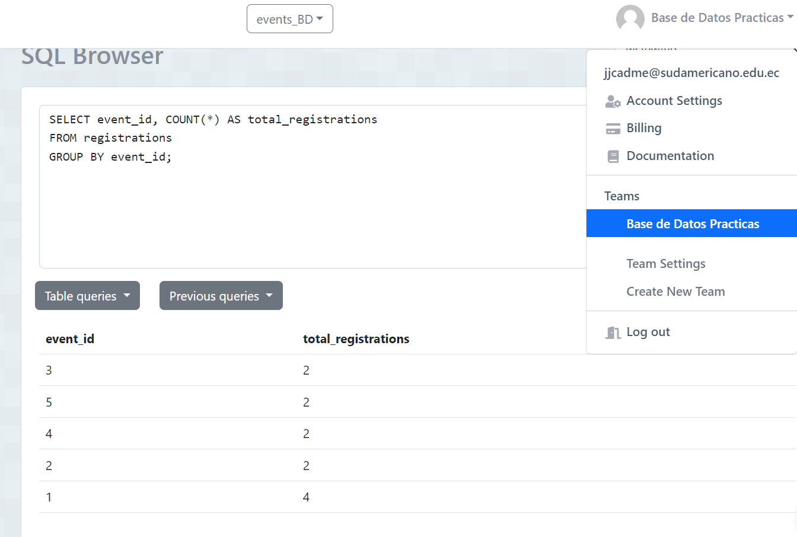

# Tarea TAS9 - Funciones de Agregación

## 1. Obtener la edad promedio de los miembros
  - Sentencia:
  ```sql
    SELECT AVG(EXTRACT(YEAR FROM AGE(birth_date))) AS average_age
    FROM members;
  Captura:


## 2. Obtener la edad mínima de los miembros
  - Sentencia:
  ```sql
    SELECT MIN(EXTRACT(YEAR FROM AGE(birth_date))) AS minimum_age
    FROM members;
  Captura:


## 3. Obtener el número total de registros asistidos
  - Sentencia:
  ```sql
    SELECT COUNT(*) AS total_registrations
    FROM registrations;
  Captura:


## 4. Obtener el número total de asistentes a todas las conferencias
  - Sentencia:
  ```sql
    SELECT COUNT(DISTINCT member_id) AS total_attendees
    FROM registrations;
  Captura:


## 5. Obtener el número total de eventos por cada ciudad
  - Sentencia:
  ```sql
    SELECT city, COUNT(*) AS total_events
    FROM events
    GROUP BY city;
  Captura:


## 6. Obtener el número de registros por cada miembro
  - Sentencia:
  ```sql
    SELECT member_id, COUNT(*) AS total_registrations
    FROM registrations
    GROUP BY member_id;
  Captura:


## 7. Obtener el número de registros por cada conferencia
  - Sentencia:
  ```sql
    SELECT event_id, COUNT(*) AS total_registrations
    FROM registrations
    GROUP BY event_id;
  Captura:

